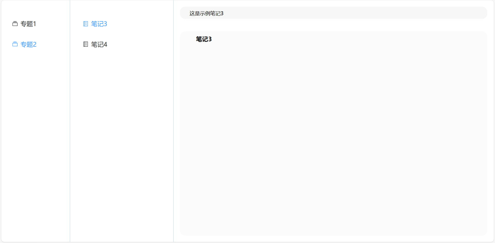

# Markdown 笔记本

[点击打开在线示例](https://loveemiliaforever.github.io/Markdown-notebook/#/)  

## 使用技术

* Vue3
* vue-axios
* vuex
* element-plus

## 项目介绍

一个简单的文件集合阅览器，使用json存储数据和前后端交互  
能够渲染markdown文件并展示出来  
逻辑简单，是一个合格的入门练手小项目  

## 项目图片

